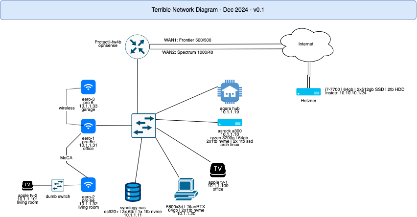

# Toplology

Terrible network diagram

After OS is installed, go through [initial setup](docs/initial_setup.md)
To do list here: [to do](docs/todo.md)

# VMs

| name             | service           | subtype      | virt-type | os       | vcpu | memory | rootfs | data-path                  | data-quota | ip         | internal-dns                | service-dns             | service-role | vrrp | vrrp-ip   | host dns  | service_ip |
| ---------------- | ----------------- | ------------ | --------- | -------- | ---- | ------ | ------ | -------------------------- | ---------- | ---------- | --------------------------- | ----------------------- | ------------ | ---- | --------- | --------- | ---------- |
| db-102           | postgres          | db           | lxc       | debian12 | 0.5  | 1024   | 8      | /mnt/data/postres          | 80         | 10.2.2.102 | db-102.blurer.net           | db.blurer.net           | primary      | 100  | 10.2.2.12 | 10.2.2.10 | 102        |
| db-103           | postgres          | db           | lxc       | debian12 | 0.5  | 1024   | 8      | /mnt/data/postres          | 80         | 10.2.2.103 | db-103.blurer.net           | db.blurer.net           | standby      | 50   | 10.2.2.12 | 10.2.2.10 | 103        |
| dns-100          | pihole            | dns          | lxc       | debian12 | 0.5  | 512    | 8      | /mnt/data/dns-100          | 16         | 10.2.2.100 | dns-100.blurer.net          | dns.blurer.net          | primary      | 100  | 10.2.2.10 | 1.1.1.1   | 100        |
| dns-101          | pihole            | dns          | lxc       | debian12 | 0.5  | 512    | 8      | /mnt/data/dns-101          | 16         | 10.2.2.101 | dns-101.blurer.net          | dns.blurer.net          | secondary    | 50   | 10.2.2.10 | 8.8.8.8   | 101        |
| bind-104         | bind              | bind         | lxc       | debian12 | 0.5  | 512    | 8      | /mnt/data/bind-104         | 16         | 10.2.2.104 | bind-104.blurer.net         | bind.blurer.net         | primary      | 100  | 10.2.2.11 | 10.2.2.10 | 104        |
| bind-105         | bind              | bind         | lxc       | debian12 | 0.5  | 512    | 8      | /mnt/data/bind-105         | 16         | 10.2.2.105 | bind-105.blurer.net         | bind.blurer.net         | secondary    | 50   | 10.2.2.11 | 10.2.2.10 | 105        |
| dash-106         | grafana           | dash         | lxc       | debian12 | 0.5  | 1024   | 8      | /mnt/data/dash-106         | 16         | 10.2.2.106 | dash-106.blurer.net         | dash.blurer.net         | n/a          | n/a  | n/a       | 10.2.2.12 | 106        |
| proxy-107        | nginxproxymanager | proxy        | lxc       | debian12 | 0.5  | 1024   | 8      | /mnt/data/proxy-107        | 16         | 10.2.2.107 | proxy-107.blurer.net        | proxy.blurer.net        | primary      | 100  | 10.2.2.13 | 10.2.2.10 | 107        |
| proxy-108        | nginxproxymanager | proxy        | lxc       | debian12 | 0.5  | 1024   | 8      | /mnt/data/proxy-108        | 16         | 10.2.2.108 | proxy-108.blurer.net        | proxy.blurer.net        | secondary    | 50   | 10.2.2.13 | 10.2.2.10 | 108        |
| k3s-master-109   | k3s               | k3s-master   | lxc       | debian12 | 2    | 2048   | 16     | /mnt/data/k3s-master-109   | 16         | 10.2.2.109 | k3s-master-109.blurer.net   | k3s-master.blurer.net   | n/a          | n/a  | n/a       | 10.2.2.10 | 109        |
| k3s-worker-1-110 | k3s               | k3s-worker-1 | lxc       | debian12 | 1    | 1024   | 8      | /mnt/data/k3s-worker-1-110 | 8          | 10.2.2.110 | k3s-worker-1-110.blurer.net | k3s-worker-1.blurer.net | n/a          | n/a  | n/a       | 10.2.2.10 | 110        |
| k3s-worker-2-111 | k3s               | k3s-worker-2 | lxc       | debian12 | 1    | 1024   | 8      | /mnt/data/k3s-worker-2-111 | 8          | 10.2.2.111 | k3s-worker-2-111.blurer.net | k3s-worker-2.blurer.net | n/a          | n/a  | n/a       | 10.2.2.10 | 111        |

## DNS

# Containers

| container name      | hostname                   | host           | function               | ports          |
|---|---|---|---|---|
| TBD|TBD|TBD|TBD|TBD|

