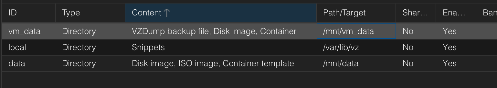

# Initial Setup

## Proxmox Setup

Run post-pve-install
- https://community-scripts.github.io/ProxmoxVE/scripts?id=post-pve-install 

## Tailscale

Add to tailscale
- ``curl -fsSL https://tailscale.com/install.sh | sh``
- ``tailscale up --accept-dns=false --advertise-exit-node --ssh --advertise-routes 10.10.10.0/24``

Enable routing
```
echo 'net.ipv4.ip_forward = 1' | sudo tee -a /etc/sysctl.d/99-tailscale.conf
echo 'net.ipv6.conf.all.forwarding = 1' | sudo tee -a /etc/sysctl.d/99-tailscale.conf
sysctl -p /etc/sysctl.d/99-tailscale.conf
NETDEV=$(ip -o route get 8.8.8.8 | cut -f 5 -d " ")
ethtool -K $NETDEV rx-udp-gro-forwarding on rx-gro-list off
```

## Disk setup

Extend vg0 to the remaining space on /dev/md1 and mount ``/mnt/vm_data``

```bash
pvcreate /dev/md1
vgextend vg0 /dev/md1
lvcreate -l 100%FREE -n vm_data vg0
mkfs.ext4 /dev/vg0/vm_data
mkdir /mnt/vm_data
mount /dev/vg0/vm_data /mnt/vm_data
```

Create ``/dev/md1``  and mount to ``/mnt/data``

```
```bash
fdisk /dev/sdc
{create the }
mount /dev/sdc1 /mnt/data
```

Ensure it is added and mounted

```
/dev/mapper/vg0-root      15G  3.5G   11G  26% /
/dev/sdc1                1.8T  276M  1.7T   1% /mnt/data
/dev/mapper/vg0-vm_data  447G   36K  424G   1% /mnt/vm_data
```

Add to ``/etc/fstab``

```
proc /proc proc defaults 0 0
# /dev/md/0
UUID=562c26f1-8e43-4820-b13d-a1e023b322ce /boot ext3 defaults 0 0
# /dev/md/1 belongs to LVM volume group 'vg0'
/dev/mapper/vg0-root  /            ext3    defaults        0 1
/dev/mapper/vg0-swap  swap         swap    defaults        0 0
/dev/mapper/vg0-vm_data /mnt/vm_data ext4 defaults 0 2
/dev/sdc1 /mnt/data ext4 defaults 0 2
```

Reboot the system, run ``lsblk`` to confirm they're mapped after reboot

```
# root @ vm in ~ [13:42:30] 
$ lsblk
NAME              MAJ:MIN RM   SIZE RO TYPE  MOUNTPOINTS
sda                 8:0    0 476.9G  0 disk  
├─sda1              8:1    0     1G  0 part  
│ └─md0             9:0    0  1022M  0 raid1 /boot
└─sda2              8:2    0 475.9G  0 part  
  └─md1             9:1    0 475.8G  0 raid1 
    ├─vg0-root    252:0    0    15G  0 lvm   /
    ├─vg0-swap    252:1    0     6G  0 lvm   [SWAP]
    └─vg0-vm_data 252:2    0 454.8G  0 lvm   /mnt/vm_data
sdb                 8:16   0 476.9G  0 disk  
├─sdb1              8:17   0     1G  0 part  
│ └─md0             9:0    0  1022M  0 raid1 /boot
└─sdb2              8:18   0 475.9G  0 part  
  └─md1             9:1    0 475.8G  0 raid1 
    ├─vg0-root    252:0    0    15G  0 lvm   /
    ├─vg0-swap    252:1    0     6G  0 lvm   [SWAP]
    └─vg0-vm_data 252:2    0 454.8G  0 lvm   /mnt/vm_data
sdc                 8:32   0   1.8T  0 disk  
└─sdc1              8:33   0   1.8T  0 part  /mnt/data
```

Add to Proxmox host
- Login to webui
- Datacenter > Storage > Add > Directory
	- ID: data
	- Directory: /mnt/data
	- Content: disk image, container template, iso image
- Datacenter > Storage > Add > Directory
	- ID: vm_data
	- Directory: /mnt/vm_data
	- Content: disk image, vzdump backup file, container



## Create network and bridge
 Need to create vmbr0 and vmbr1, swing the wanip to vmbr0 and create 10.10.10.0/24 on vmbr1.

```
auto lo
iface lo inet loopback

# WAN bridge
auto vmbr1
iface vmbr1 inet static
    address {wan_ip}/{wan_mask}
    gateway {wan_gw}
    bridge-ports enp0s31f6
    bridge-stp off
    bridge-fd 0
    up route add -net {wan_ip} netmask 255.255.255.192 gw {wan_gw} dev vmbr1


iface vmbr1 inet6 static
    address {ipv6_addr}
    gateway fe80::1

# LAN bridge
auto vmbr0
iface vmbr0 inet static
    address 10.10.10.1/24
    bridge-ports none
    bridge-stp off
    bridge-fd 0

```

After added, hold your beer and restart network, ``systemctl restart networking`` then try to ping the inside subnet (10.10.10.1).
``
```
# bl @ Bryans-MacBook-Pro in ~/Documents/obsidian/devops on git:main x [13:58:45] 
$ ping 10.10.10.1 -c 5
PING 10.10.10.1 (10.10.10.1): 56 data bytes
64 bytes from 10.10.10.1: icmp_seq=0 ttl=64 time=136.909 ms
64 bytes from 10.10.10.1: icmp_seq=1 ttl=64 time=146.921 ms
64 bytes from 10.10.10.1: icmp_seq=2 ttl=64 time=144.034 ms
64 bytes from 10.10.10.1: icmp_seq=3 ttl=64 time=144.756 ms
64 bytes from 10.10.10.1: icmp_seq=4 ttl=64 time=149.107 ms

--- 10.10.10.1 ping statistics ---
5 packets transmitted, 5 packets received, 0.0% packet loss
round-trip min/avg/max/stddev = 136.909/144.345/149.107/4.120 ms
```

Enable NAT

```
iptables -t nat -A POSTROUTING -s 10.10.10.0/24 -o vmbr1 -j MASQUERADE\niptables -A FORWARD -i vmbr0 -o vmbr1 -j ACCEPT\niptables -A FORWARD -i vmbr1 -o vmbr0 -m state --state RELATED,ESTABLISHED -j ACCEPT\n
apt install iptables-persistent\n
iptables-save > /etc/iptables/rules.v4\n
```


## Test 

Create a test vm with the following:

```
network: 10.10.10.10/24
gateway: 10.10.10.1
dns: 1.1.1.1
```

And test that you can ping outbound:

```
[root@test-vm ~]# ping 1.1.1.1 -c 4
PING 1.1.1.1 (1.1.1.1) 56(84) bytes of data.
64 bytes from 1.1.1.1: icmp_seq=1 ttl=57 time=5.42 ms
64 bytes from 1.1.1.1: icmp_seq=2 ttl=57 time=5.64 ms
64 bytes from 1.1.1.1: icmp_seq=3 ttl=57 time=5.59 ms
64 bytes from 1.1.1.1: icmp_seq=4 ttl=57 time=5.57 ms

--- 1.1.1.1 ping statistics ---
4 packets transmitted, 4 received, 0% packet loss, time 3005ms
rtt min/avg/max/mdev = 5.415/5.552/5.636/0.082
```

